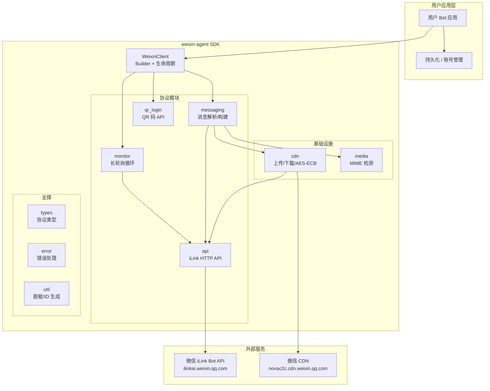

# 整体架构

## 模块职责

| 模块 | 职责 |
|------|------|
| `client` | SDK 入口，Builder 模式，生命周期管理，优雅关闭 |
| `api` | 5 个 iLink Bot HTTP API 端点封装 + Session Guard + Config Cache |
| `monitor` | 长轮询循环，断线重连，退避策略，sync_buf 回调 |
| `messaging` | 入站消息解析，出站消息构建，Context Token 内存管理 |
| `cdn` | CDN 文件上传/下载，AES-128-ECB 加解密 |
| `qr_login` | QR 码获取 + 状态轮询 API |
| `media` | MIME 类型检测（46 项映射） |
| `types` | 协议数据类型、常量、枚举 |
| `error` | 统一错误枚举（`#[non_exhaustive]`） |
| `util` | 日志脱敏、随机 ID 生成 |
