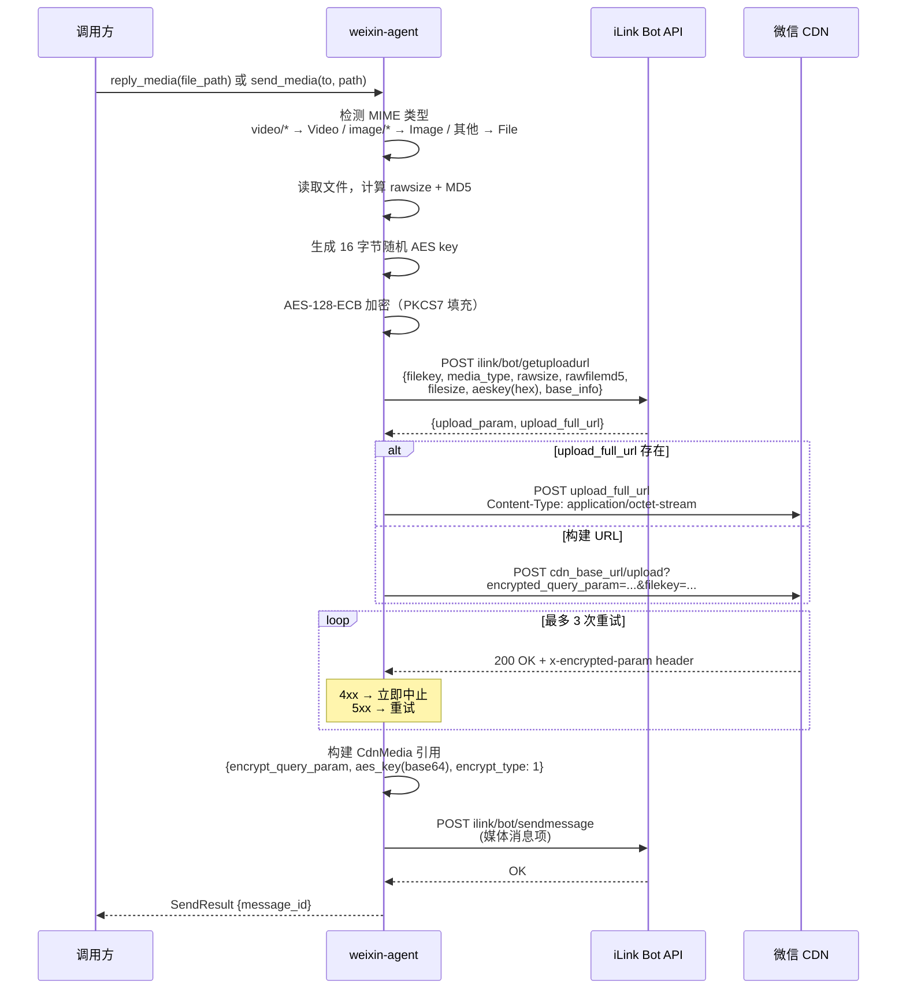

# CDN 上传流程

## AES-128-ECB 加密细节

| 项目 | 值 |
|------|-----|
| 算法 | AES-128-ECB |
| 填充 | PKCS7 |
| Key 长度 | 16 字节（随机生成） |
| Key 传给 API | hex 编码 |
| Key 放入消息 | base64(hex_string_bytes) |
| 加密后大小 | `((plaintext_size + 1 + 15) / 16) * 16` |
| filekey | 32 字符随机 hex |

## AES Key 解析（下载解密时）

服务端返回的 AES key 有两种编码格式：

| 格式 | 场景 | 解析方式 |
|------|------|---------|
| base64 → 16 字节 | 图片 | 直接使用 |
| base64 → 32 hex 字符 → 16 字节 | 文件/语音/视频 | hex 解码 |

图片特殊处理：优先使用 `ImageItem.aeskey`（hex 编码），回退到 `media.aes_key`。
