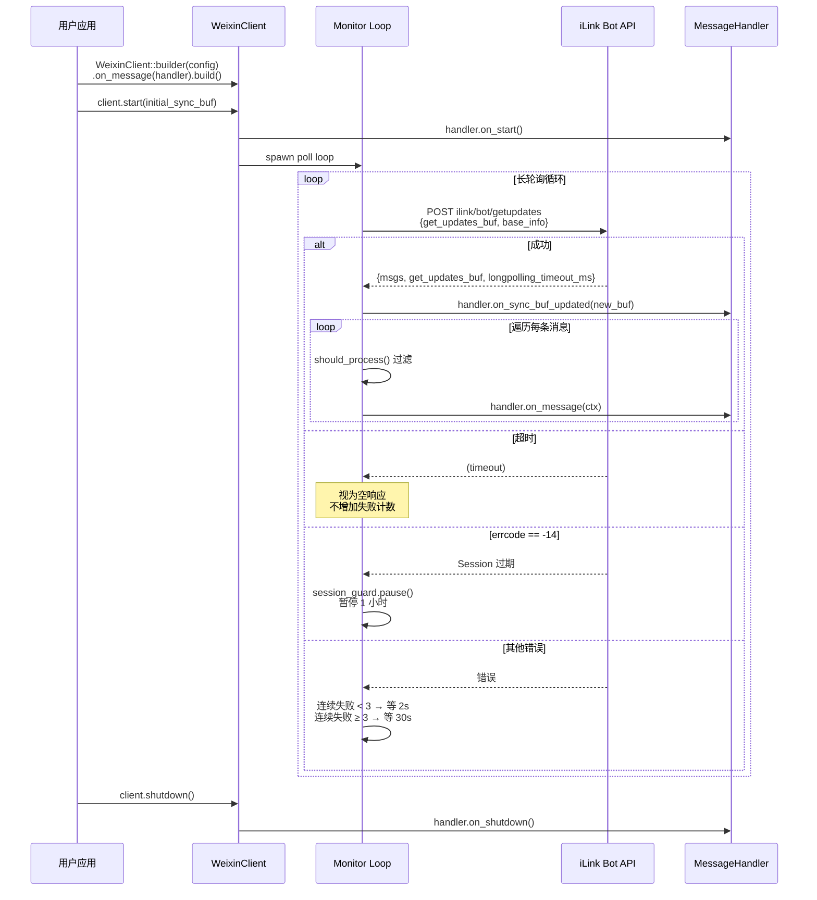

# 长轮询生命周期

## 关键参数

| 参数 | 值 | 说明 |
|------|-----|------|
| 长轮询超时 | 35s（服务端可动态调整） | `longpolling_timeout_ms` |
| 最大连续失败 | 3 次 | 超过后进入退避 |
| 退避延迟 | 30s | 连续失败 ≥ 3 |
| 重试延迟 | 2s | 连续失败 < 3 |
| Session 暂停 | 1 小时 | errcode == -14 |

## 消息过滤规则

Monitor 在分发给 Handler 前自动过滤：

- 只处理 `message_type == USER (1)` 的消息
- 跳过 `delete_time_ms > 0` 的撤回消息
- 跳过 `message_state == GENERATING (1)` 的未完成消息
